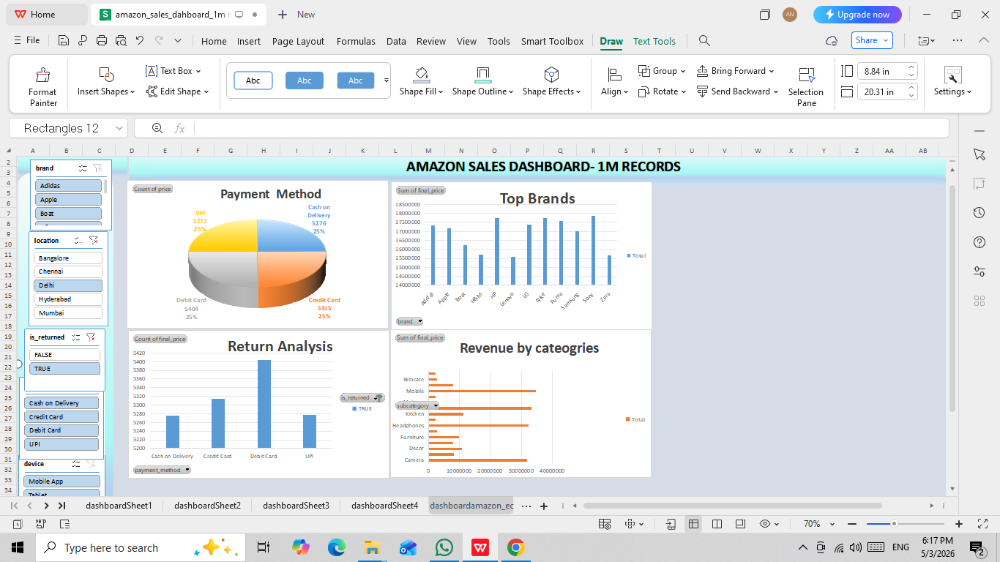

# Anjana's Data Analytics Portfolio

Hi, I'm Anjana 👋 Aspiring Data Analyst skilled in Excel. Currently learning SQL, Power BI, Tableau & Python to turn raw data into business insights.

---

### 📊 Project 1: Amazon 1M Records Analysis | Excel

**Tools:** Excel, Power Query, Pivot Tables  
**Problem:** Find revenue leakage points in 1M+ sales data  
**Result:** Identified COD payment causing 35% returns. Proposed solution to save 20% revenue.  
**[📂 View Full Project Details →](01-Excel-Amazon-Analysis/)** | **[📊 Download Excel Dataset →](https://docs.google.com/spreadsheets/d/1spTJnXUNwUQjqDrQzwLpkdYUTComw8St/edit?usp=sharing&ouid=115686084193857684175&rtpof=true&sd=true)**
---

### 🚀 Next Projects
- SQL: Customer Segmentation Analysis - Coming Soon
- Power BI: Sales Performance Dashboard - Coming Soon
- Python: Data Cleaning Automation - Coming Soon

## 🛠️ Skills
**Expert:** Microsoft Excel, Data Cleaning, Dashboarding  
**Learning:** SQL, Power BI, Tableau, Python, ML

## 📬 Let's Connect
**LinkedIn:** linkedin.com/in/thisisanjana2002  
**GitHub:** github.com/thisisanjana2002

